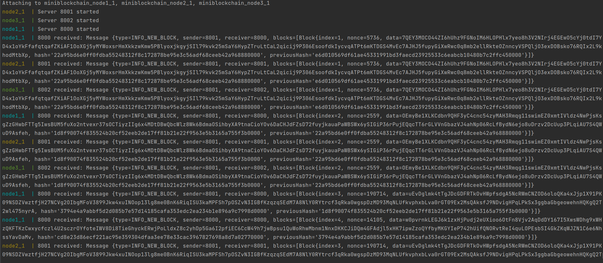

# Mini Blockchain

## Task

- [Task 1](https://github.com/SemenMartynov/Software-Engineering-2022/blob/main/Task1.md) 

## Descreption project

- Application describe how to mini blockchain run 

## Technology:
- maven
- Java,jupiter test
- java socket
- git-flow

## Requirement 
- java jdk 11, docker and docker-compose
## Run project with docker
1. Clone project from github
```bash
$ git clone git@github.com:Phambanam/mini_blockchain.git
```
2. CD into project folder
```bash
cd mini_blockchain
```
3. Run project with docker compose
```bash
docker-compose up 
```

## Result with docker-compose 

## License
- [MIT](/LICENSE)
## Testing
- main [](https://github.com/Phambanam/mini_blockchain/actions/workflows/test.yml)
- develop [](https://github.com/Phambanam/mini_blockchain/actions/workflows/test.yml)